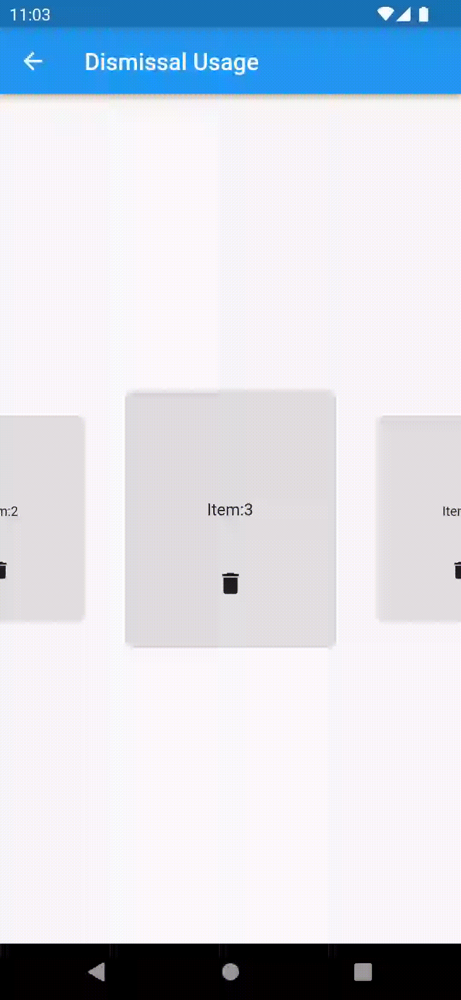

This is a view pager provides carousel effect and dismissal animation when page was removed.

## Features

* Dismissal animation

| Fade out & slide out                                                                        | Fade out & scale                                                                   | Fade out & circular hide                                                             |
|---------------------------------------------------------------------------------------------|------------------------------------------------------------------------------------|--------------------------------------------------------------------------------------|
|  |  |  |

* Carousel effect

| Horizontal                                                             | Vertical                                                           |
|------------------------------------------------------------------------|--------------------------------------------------------------------|
|  |  |

## Web Live demo
This an example app of this plugin of web version.

https://zyzdev.github.io/dismissible_carousel_viewpager

## Usage

More detail of usage see `/example` app.

### Base usage:
More detail, please run demo `Base Usage` at `/example` app.

```dart
DismissibleCarouselViewPager(
  viewportFraction: 0.5,
  besidePageScale: 0.8,
  itemBuilder: (context, index) {
    return Container(
      alignment: Alignment.center,
      color: index.isEven
      ? Colors.blueAccent.withOpacity(0.1)
      : Colors.deepPurpleAccent.withOpacity(0.1),
      child: Text("Item:$index"),
    ); 
  },
  itemCount: 100,
);
```
### Dismissal animation
More detail please run demo `Dismissal Usage` at `/example` app.

`dismissible_carousel_viewpager` provides several kinds of animation(`fade out`, `slide out`, `scale` and `circular hide`) to make dismissal animation.

You can combine them to make your own style of dismissal animation.


#### *Note*
The dismissal animation base on `AnimatedSwitcher`.

Remember add `key` to the page widget that created by `DismissibleCarouselViewPager.itemBuilder`.

I recommend using the `data` that preparing to create page widget to create `Key("$data")`, `ValueKey(data)` or `ObjectKey(data)` for the page widget.

####*example:*
```dart

late final List<int> _item = List.generate(1000, (index) => index);

DismissibleCarouselViewPager(
  itemCount: _item.length,
  itemBuilder: (context, index) {
    Object data = _item[index];
    return Container(
      // must add key
      key: Key("$data"),
      //key: ValueKey(data),
      //key: ObjectKey(data),
      alignment: Alignment.center,
      color: Colors.grey.withOpacity(0.1),
      child: Column(
        mainAxisSize: MainAxisSize.min,
        children: [
        Expanded(
          child: Container(
            alignment: Alignment.bottomCenter,
            child: Text("Item:$data"),
          ),
        ),
        Expanded(
          child: IconButton(
            icon: const Icon(Icons.delete),
            onPressed: () {
                setState(() {
                  _item.remove(data);
                });
              },
            ),
          ),
        ],
      ),
    );
  },
  dismissalConfig: DismissalConfig(
    dismissalTypes: [
      DismissalType.fadeOut(),
      DismissalType.slideOut(),
    ],
  ),
);
```
